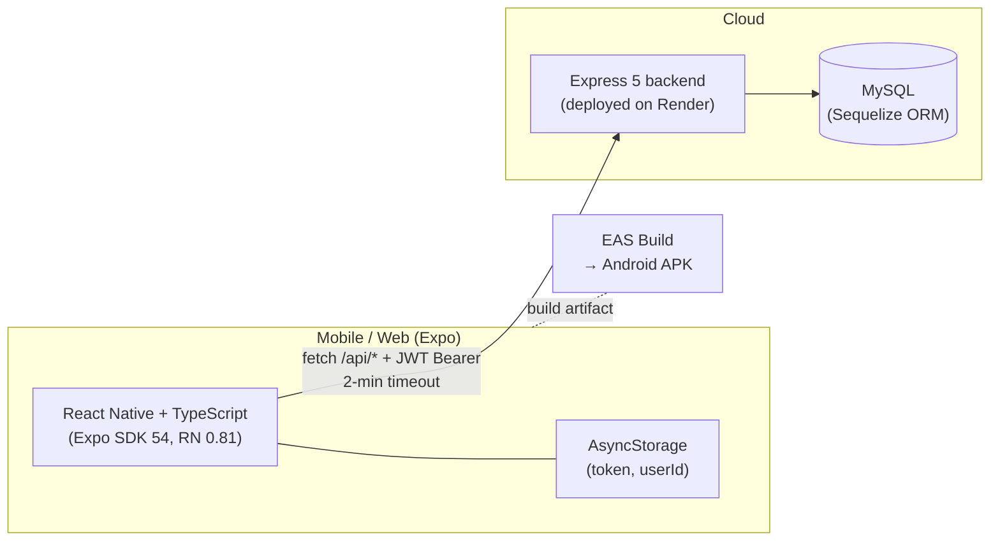
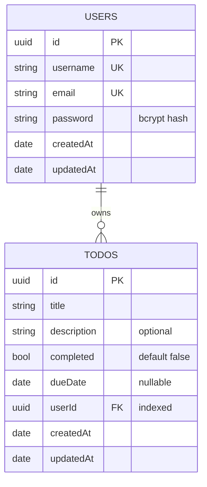

# To-Do List

> A multi-user todo system with a native mobile app — sign up, sign in, and manage tasks from your phone with cloud sync.

The system spans **two repositories**:

| Repository | What it is | Stack |
|---|---|---|
| [`todo-list`](https://github.com/Asciente-rks/todo-list) | REST API backend | Express 5 + Sequelize + MySQL + JWT |
| [`todo-list-frontend`](https://github.com/Asciente-rks/todo-list-frontend) | Mobile + web client | **Expo / React Native** (Android, iOS, web) |

📱 **Distribution:** Android APK via Expo Application Services (EAS Build).

> **You're reading the README in one of those repos.** The same overview lives in both — scroll to [Local Development](#local-development) for setup specific to this repo.

---

## Table of Contents

1. [What It Does](#what-it-does)
2. [System Architecture](#system-architecture)
3. [Tech Stack](#tech-stack)
4. [Repository Layout](#repository-layout)
5. [Database Design](#database-design)
6. [API Reference](#api-reference)
7. [Mobile App Notes](#mobile-app-notes)
8. [Cold-Start Resilience](#cold-start-resilience)
9. [Deployment](#deployment)
10. [Local Development](#local-development)
11. [Environment Variables](#environment-variables)

---

## What It Does

- **Register** with username, email, and password (bcrypt-hashed).
- **Sign in** to get a JWT, persisted in `AsyncStorage` on the device.
- **Create todos** with title, description, optional due date.
- **Toggle completed**, edit, and delete — all changes sync to the server.
- **Per-user data**: each user only sees and can mutate their own todos (FK-enforced).
- **Native mobile app**: Android, iOS, and web from a single Expo codebase.
- **Friendly cold-start UX**: when the backend is sleeping (Render free tier), the app shows a "Waking up the server" notice instead of a confusing error.

---

## System Architecture



The mobile app talks to a stateless Express API. JWTs are issued on login and stored on-device in `AsyncStorage`. Every authenticated request sends `Authorization: Bearer <token>`. The API uses Sequelize for MySQL persistence.

---

## Tech Stack

### Backend (`todo-list`)

| Concern | Choice |
|---|---|
| Language | **TypeScript 5** |
| HTTP framework | **Express 5** |
| ORM | **Sequelize 6** |
| Database | **MySQL** (`mysql2` driver) |
| Auth | **JWT** (`jsonwebtoken`) + **bcrypt** |
| Validation | **yup** |
| Dev | `ts-node-dev` (`--respawn --transpile-only --poll`) |
| Hosting | **Render** Web Service (default branch is `master`) |

Default branch is `master` (not `main`) on this repo.

### Frontend (`todo-list-frontend`)

| Concern | Choice |
|---|---|
| Language | **TypeScript 5**, React **19** |
| Framework | **Expo SDK 54** (React Native 0.81) |
| Storage | `@react-native-async-storage/async-storage` |
| Date pickers | `@react-native-community/datetimepicker` |
| Icons | **lucide-react-native** |
| HTTP | Plain `fetch` wrapper (`src/api/client.ts`) with 2-min `AbortController` timeout |
| Build/distribution | **EAS Build** (`eas.json`) — Android APK + iOS + web |
| Android package | `com.ascienterks.todolisttsfrontend` |

---

## Repository Layout

### Backend

```
todo-list/
├── package.json                       # Express 5, Sequelize, JWT, bcrypt, yup
├── tsconfig.json
└── src/
    ├── server.ts                      # CORS, JSON, request logging,
    │                                  # /api/users + /api/todos mounts,
    │                                  # /health probe, 404 + error handler
    ├── associations/
    │   └── associations.ts            # User.hasMany(Todo) + Todo.belongsTo(User)
    ├── models/
    │   ├── users/user.sequelize.ts    # id, username, email, password
    │   └── todo/todo.sequelize.ts     # id, title, description, completed,
    │                                  # dueDate, userId
    ├── controllers/                   # Per-resource controllers
    ├── services/                      # Business logic
    ├── repositories/                  # Sequelize query layer
    ├── routes/
    │   ├── users/user.routes.ts       # /api/users/*  (incl. /login, /register)
    │   └── todo/todo.routes.ts        # /api/todos/*
    ├── middlewares/                   # auth + validation
    ├── dtos/                          # Request/response shapes
    └── utils/                         # db.ts, helpers
```

### Frontend (Expo)

```
todo-list-frontend/
├── package.json                       # Expo 54, RN 0.81, React 19
├── app.json                           # Expo app config (icons, package, EAS projectId)
├── eas.json                           # EAS Build profiles (preview APK + production)
├── tsconfig.json
├── index.ts                           # registerRootComponent(App)
├── App.tsx                            # Auth gate → Login / Register / TodoScreen
├── assets/                            # icon.png, splash, adaptive-icon, favicon
└── src/
    ├── api/
    │   ├── client.ts                  # fetch wrapper, 2-min timeout, JWT injector
    │   ├── retryWrapper.ts            # Retry logic for cold-starts
    │   ├── authService.ts             # /api/users/login + /register
    │   ├── todoService.ts             # /api/todos CRUD
    │   └── userService.ts
    ├── assets/                        # Icon GIFs (add, check-mark, to-do, trash)
    ├── components/
    │   ├── TodoInput.tsx
    │   ├── TodoItem.tsx
    │   └── WakeUpNotice.tsx           # "Server waking up" banner
    ├── screens/
    │   ├── LoginScreen.tsx
    │   ├── RegisterScreen.tsx
    │   └── TodoScreen.tsx             # Main list + actions (~26KB)
    ├── theme.ts                       # Colors / spacing tokens
    └── types/
        └── todo.ts
```

---

## Database Design

Two tables. Both keyed by UUID v4. The relationship is a simple 1-to-many (one user → many todos).



Notes:

- **`todos.userId` is indexed** explicitly (`indexes: [{ fields: ["userId"] }]`) so per-user list queries hit the index and stay fast as the table grows.
- The Sequelize association in `src/associations/associations.ts` defines:
  ```typescript
  User.hasMany(Todo, { foreignKey: "userId", as: "todos" });
  Todo.belongsTo(User, { foreignKey: "userId", as: "user" });
  ```
- Schema is created/updated by `sequelize.sync()` on server startup. There are no migrations — for production-grade evolution, layer in `sequelize-cli` migrations.

---

## API Reference

The mobile app talks to two route groups plus a couple of housekeeping endpoints.

| Method | Path | Auth | Purpose |
|---|---|---|---|
| `GET` | `/` | none | Plain text liveness ("Server is alive") |
| `GET` | `/api` | none | JSON liveness (`{ status: "online", message: ... }`) |
| `GET` | `/health` | none | JSON health probe (`{ status: "UP", service, timestamp }`) |
| `POST` | `/api/users/register` | none | Create a user — bcrypt-hash password, return JWT |
| `POST` | `/api/users/login` | none | Verify credentials → return JWT |
| `GET` / `PUT` / `DELETE` | `/api/users/:id` | JWT | Profile CRUD |
| `GET` | `/api/todos` | JWT | List todos for the authenticated user |
| `POST` | `/api/todos` | JWT | Create a new todo |
| `PATCH` / `PUT` | `/api/todos/:id` | JWT | Update title / description / completed / dueDate |
| `DELETE` | `/api/todos/:id` | JWT | Delete a todo |

CORS is wide open (`origin: "*"`) since the client is a mobile app, not a same-origin web page. Every request is logged with `[ISO-timestamp] METHOD URL` for Render's log explorer, and unhandled paths fall through to a structured 404 + global error handler.

---

## Mobile App Notes

- **Single-flag auth state.** `App.tsx` keeps `isAuthenticated` and `isRegistering` in component state; on app start, stale tokens are cleared from `AsyncStorage` so the user lands on Login. Sign-in callbacks bump the gate to render `TodoScreen`.
- **Register / Login symmetry.** Both screens share `onAuthSuccess` and a switch toggle so the user can flip between them with no navigation library — keeps the bundle small.
- **API URL hierarchy.** `client.ts` reads `Constants.expoConfig?.extra?.EXPO_PUBLIC_API_URL_PLAIN`, falling back to the production Render URL. `eas.json` injects `EXPO_PUBLIC_API_URL` per build profile (preview + production).
- **Centralized fetch wrapper** with:
  - 2-minute `AbortController` timeout (covers Render cold-starts)
  - JWT auto-attach
  - 4xx errors annotated with `.status` so callers can branch on validation vs network
  - Quiet logging on validation errors (no scary red logs for normal 400s)

---

## Cold-Start Resilience

The backend runs on Render's free tier, which puts dynos to sleep after inactivity. A cold start can take 30-60 seconds.

The mobile app handles this gracefully:

- **2-minute request timeout** — generous enough to wait out a cold start.
- **`WakeUpNotice` component** — shows a friendly "Waking up the server, this may take a minute" banner instead of a generic spinner.
- **`retryWrapper.ts`** — wraps the fetch wrapper with bounded retries on transient network failures (without retrying on 4xx validation errors).

For paying tiers / always-on hosting, none of this is needed — the same code just makes requests faster.

---

## Deployment

### Backend → Render Web Service

The production backend is hosted at **`https://todo-list-backend-4li8.onrender.com/api`**.

To deploy your own:

1. Create a Render Web Service pointing at this repo, branch **`master`**.
2. Set build command `npm install && npm run build`, start command `npm start`.
3. Provision a MySQL database (Render, PlanetScale, AWS RDS, etc.).
4. Set the environment variables listed below.
5. Render auto-deploys on every push to `master`.

The `Cache-Control: no-store` header on `/health` plus the `/` and `/api` liveness routes are designed to keep Render's health checks happy.

### Frontend → Expo Application Services (EAS)

```bash
cd todo-list-frontend
npm install
npx eas build --platform android --profile preview      # APK for sideloading
npx eas build --platform android --profile production   # AAB for Play Store
npx eas build --platform ios --profile production       # iOS build
```

EAS profiles in `eas.json`:

- **development** — Expo dev client, internal distribution.
- **preview** — APK for direct install / internal testing.
- **production** — release builds with `EXPO_PUBLIC_API_URL` baked in.

EAS project ID: `64c99027-1e5b-4869-9ba5-ff08d77c8258`.

---

## Local Development

### Backend

```bash
git clone https://github.com/Asciente-rks/todo-list.git
cd todo-list
npm install

# Provision local MySQL with a database matching your .env
npm run dev    # ts-node-dev with --respawn --transpile-only on src/server.ts
```

Server listens on `process.env.PORT` (Render injects this) or `10000` by default.

### Frontend (mobile dev)

```bash
git clone https://github.com/Asciente-rks/todo-list-frontend.git
cd todo-list-frontend
npm install

npm start        # Expo dev server with QR code
npm run android  # Android emulator / connected device
npm run ios      # iOS simulator (macOS only)
npm run web      # Web preview
```

Either install **Expo Go** on your phone and scan the QR code, or use a connected emulator. Set `EXPO_PUBLIC_API_URL_PLAIN` in `app.json` (or via `EAS` secrets) to point at your local backend (`http://<your-LAN-ip>:10000/api`) when developing.

---

## Environment Variables

### Backend (`.env`)

```env
PORT=10000
NODE_ENV=development

# MySQL
DB_HOST=...
DB_PORT=3306
DB_NAME=todo_list
DB_USER=...
DB_PASSWORD=...

# Auth
JWT_SECRET=...
JWT_EXPIRES_IN=7d
```

### Frontend (`app.json` extra OR `eas.json` env)

```json
"extra": {
  "EXPO_PUBLIC_API_URL_PLAIN": "https://todo-list-backend-4li8.onrender.com/api"
}
```

For EAS builds, set per profile in `eas.json`:

```json
"production": {
  "env": {
    "EXPO_PUBLIC_API_URL": "https://todo-list-backend-4li8.onrender.com/api"
  }
}
```

---

## Author

Built by [Asciente-rks](https://github.com/Asciente-rks). The Android app lives at package id `com.ascienterks.todolisttsfrontend`; production builds are distributed via EAS.
