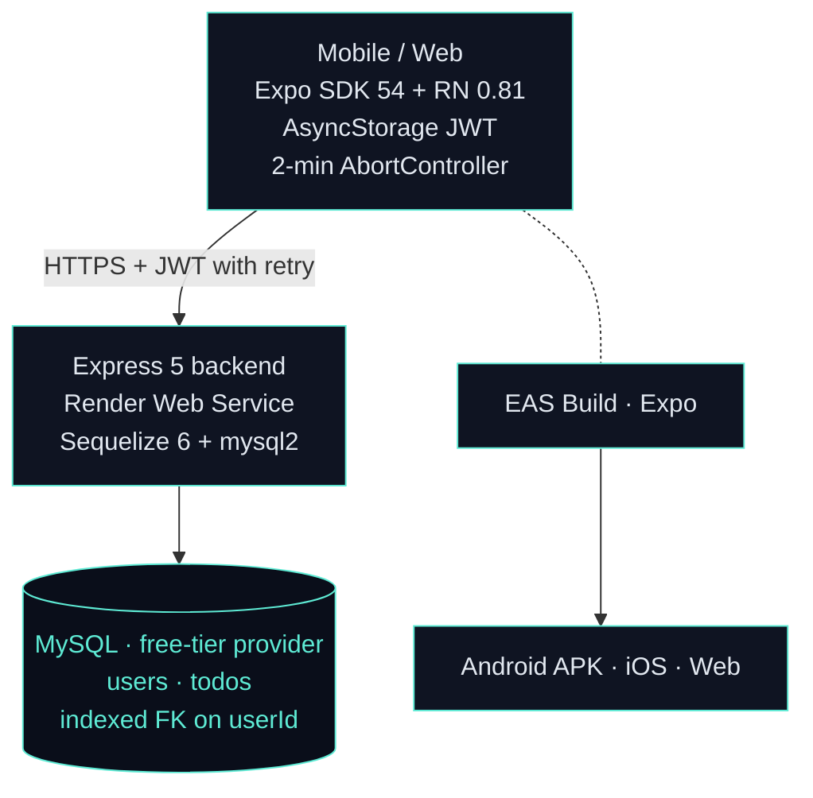
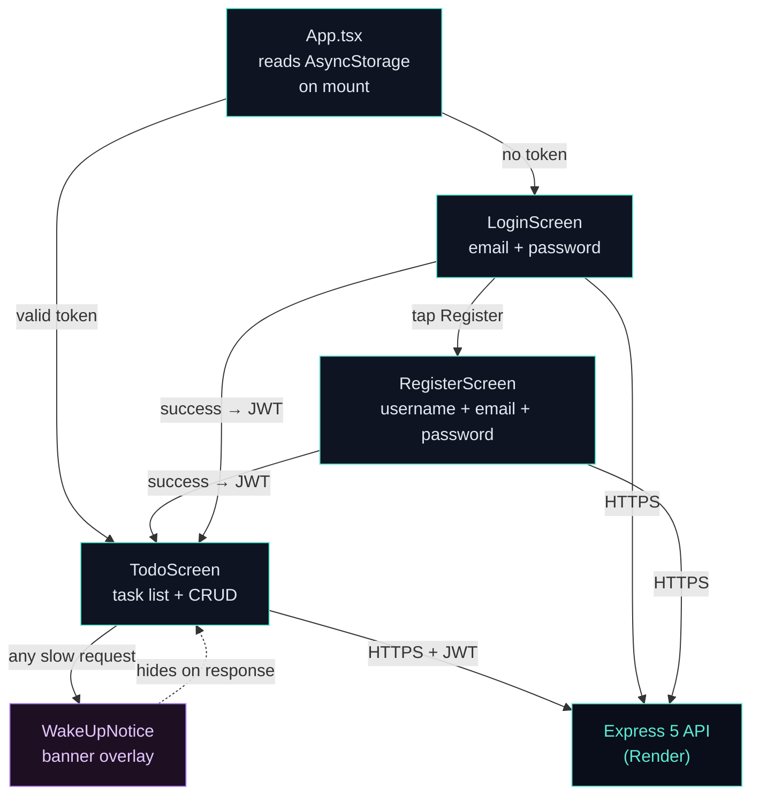
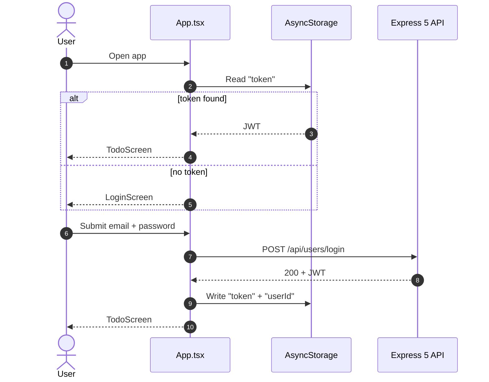
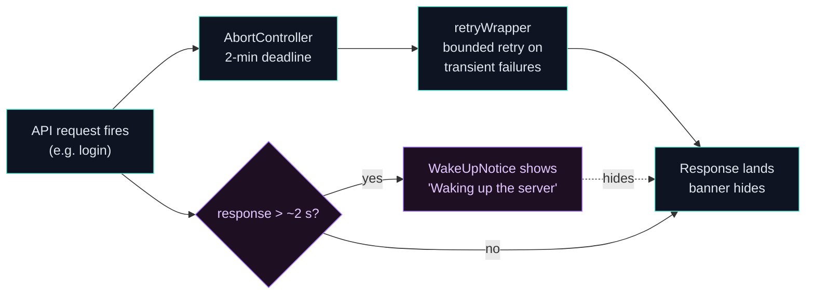

# To-Do List — Frontend

> A cross-platform mobile client for the To-Do List App — sign up, sign in, and manage tasks on Android, iOS, or the browser from a single Expo / React Native codebase.

This is the **mobile + web** half of the To-Do List App: an Expo SDK 54 / React Native 0.81 client distributed as an Android APK via EAS Build, with TypeScript throughout. It speaks to the [todo-list](https://github.com/Asciente-rks/todo-list) Express + Sequelize + MySQL backend over HTTPS + JWT, handles Render's free-tier cold starts gracefully with a 2-minute timeout and a `WakeUpNotice` banner, and requires no navigation library — a single boolean flag in `App.tsx` gates auth state.

---

## Download

- **Android APK:** [GitHub Releases](https://github.com/Asciente-rks/todo-list-frontend/releases) — sideload directly on any Android device
- **EAS Build page:** [Expo project builds](https://expo.dev/accounts/asciente-rks/projects/to-do-list-ts-frontend/builds/b3c0fe0b-93d5-4a8d-a56f-7ebd12440418)
- **Live API:** [todo-list-backend-4li8.onrender.com/api](https://todo-list-backend-4li8.onrender.com/api)

> Cold start: Render's free tier sleeps after 15 min idle — the app shows a friendly "Waking up the server" banner while the backend wakes up (~30–60 s first request).

---

## Table of Contents

1. [What It Does](#what-it-does)
2. [Architecture](#architecture)
3. [Screen Flow](#screen-flow)
4. [Tech Stack](#tech-stack)
5. [Repository Layout](#repository-layout)
6. [API Reference](#api-reference)
7. [Authentication & Credentials](#authentication--credentials)
8. [Cold-Start Handling](#cold-start-handling)
9. [Build & Distribution](#build--distribution)
10. [Cost Breakdown](#cost-breakdown)
11. [Local Development](#local-development)
12. [Repos](#repos)
13. [Author](#author)

---

## What It Does

- **Register** — username, email, and password; bcrypt-hashed server-side, JWT returned on success and stored immediately.
- **Sign in** — email + password → JWT persisted in `AsyncStorage`; survives app restarts.
- **Create todos** — title, optional description, optional due date via a native date picker.
- **Toggle completed** — optimistic UI update synced to the server.
- **Edit & delete** — all mutations sync to the backend; per-user FK enforcement means only your own todos are ever visible.
- **Cold-start UX** — `WakeUpNotice` banner + 2-minute `AbortController` timeout + retry wrapper so the Render free-tier sleep is invisible as an error.
- **Cross-platform** — one codebase targets Android APK, iOS, and web via Expo.

---

## Architecture



### Notable architectural choices

- **No navigation library.** `App.tsx` holds two booleans — `isAuthenticated` + `isRegistering` — and renders `<LoginScreen>`, `<RegisterScreen>`, or `<TodoScreen>` directly. Keeps the bundle small and removes a peer-dep surface area.
- **Centralized fetch wrapper** (`src/api/client.ts`) attaches the JWT `Bearer` token on every request, enforces a 2-minute `AbortController` timeout, and annotates 4xx responses with a `.status` field so callers can branch on validation errors vs. network failures without catching raw `Error` objects.
- **Retry wrapper** (`src/api/retryWrapper.ts`) wraps the fetch layer with bounded retries on transient failures — skips retry on 4xx validation errors.
- **JWT in `AsyncStorage`** — cross-platform persistent token store. No platform-specific secure storage needed at portfolio scale; works identically on Android, iOS, and web.
- **Render cold-start handling** — `WakeUpNotice.tsx` displays a friendly banner when the first request is slow; the 2-minute timeout gives the backend time to wake without surfacing a timeout error to the user.

---

## Screen Flow



---

## Tech Stack

| Layer | Technology | Why |
|-------|-----------|-----|
| Framework | **Expo SDK 54** + React Native 0.81 + React 19 | One codebase → Android, iOS, web |
| Language | TypeScript 5.9 | Type safety across screens + API layer |
| Storage | `@react-native-async-storage/async-storage` 2.2.0 | Cross-platform persistent JWT store |
| Date pickers | `@react-native-community/datetimepicker` 8.4.4 | Native UI per platform |
| Icons | `lucide-react-native` 1.7.0 | Consistent SVG icon set |
| HTTP | Plain `fetch` wrapper (`src/api/client.ts`) | 2-min `AbortController`, JWT auto-attach, annotated errors |
| Build | **EAS Build** (`eas.json`) | Cloud builds — Android APK/AAB + iOS |
| Distribution | GitHub Releases (APK sideload) | Free, no Play Store review overhead |

---

## Repository Layout

```
todo-list-frontend/
├── package.json                           # Expo 54, RN 0.81, React 19
├── app.json                               # Expo app config (icons, package, EAS projectId)
├── eas.json                               # EAS Build profiles (preview APK + production)
├── tsconfig.json
├── index.ts                               # registerRootComponent(App)
├── App.tsx                                # Auth gate → Login / Register / TodoScreen
├── assets/                                # icon.png, splash, adaptive-icon, favicon
└── src/
    ├── api/
    │   ├── client.ts                      # fetch wrapper, 2-min timeout, JWT injector
    │   ├── retryWrapper.ts                # Retry logic for cold-starts
    │   ├── authService.ts                 # /api/users/login + /register
    │   ├── todoService.ts                 # /api/todos CRUD
    │   └── userService.ts
    ├── assets/                            # Icon GIFs (add, check-mark, to-do, trash)
    ├── components/
    │   ├── TodoInput.tsx
    │   ├── TodoItem.tsx
    │   └── WakeUpNotice.tsx               # "Server waking up" banner
    ├── screens/
    │   ├── LoginScreen.tsx
    │   ├── RegisterScreen.tsx
    │   └── TodoScreen.tsx                 # Main list + actions (~26 KB)
    ├── theme.ts                           # Colors / spacing tokens
    └── types/
        └── todo.ts
```

---

## API Reference

All requests go to `EXPO_PUBLIC_API_URL` (baked in at EAS build time).

| Method | Path | Auth | Purpose |
|--------|------|------|---------|
| `GET` | `/` | none | Plaintext liveness ("Server is alive") |
| `GET` | `/api` | none | JSON liveness (`{ status: "online", message: ... }`) |
| `GET` | `/health` | none | JSON health probe (`{ status: "UP", service, timestamp }`) |
| `POST` | `/api/users/register` | none | Create a user — bcrypt-hash password, return JWT |
| `POST` | `/api/users/login` | none | Verify credentials → return JWT |
| `GET` / `PUT` / `DELETE` | `/api/users/:id` | JWT | Profile CRUD |
| `GET` | `/api/todos` | JWT | List todos for the authenticated user |
| `POST` | `/api/todos` | JWT | Create a new todo |
| `PATCH` / `PUT` | `/api/todos/:id` | JWT | Update title / description / completed / dueDate |
| `DELETE` | `/api/todos/:id` | JWT | Delete a todo |

CORS is wide open (`origin: "*"`) since the client is a mobile app, not a same-origin web page.

---

## Authentication & Credentials

There are **no seeded accounts** — register through the sign-up flow.

### Self-registration

1. Open the app (Expo Go or installed APK).
2. Tap **Register**.
3. Enter username, email, password.
4. Tap **Sign Up** — receive a JWT, get logged in automatically.

### Sign-in flow

1. Tap **Sign In**.
2. Enter email + password.
3. JWT stored in `AsyncStorage` (`token` key) + `userId`.
4. Token persists across app restarts; `App.tsx` clears stale tokens on initial mount and re-routes to Login.



---

## Cold-Start Handling



- **`client.ts`** — every `fetch` call is wrapped in an `AbortController` with a 2-minute signal; generous enough to wait out a Render cold start.
- **`WakeUpNotice.tsx`** — shown by `TodoScreen` and `LoginScreen` when any request is slow; disappears when the response arrives.
- **`retryWrapper.ts`** — bounded retry on transient network failures; skips retry on 4xx validation errors.

For paying tiers / always-on hosting, none of this is needed — the same code just makes requests faster.

---

## Build & Distribution

```bash
# Install
cd todo-list-frontend
npm install

# Local dev
npm start              # Expo dev server with QR code
npm run android        # Android emulator / connected device
npm run ios            # iOS simulator (macOS only)
npm run web            # Web preview at localhost:8081

# EAS cloud builds
npx eas build --platform android --profile preview     # APK for sideloading
npx eas build --platform android --profile production  # AAB for Play Store
npx eas build --platform ios --profile production      # iOS build
```

EAS profiles in `eas.json`:

- **development** — Expo dev client, internal distribution.
- **preview** — APK for direct install / internal testing.
- **production** — release builds with `EXPO_PUBLIC_API_URL` baked in.

EAS project ID: `64c99027-1e5b-4869-9ba5-ff08d77c8258`.

Distribute the resulting APK however you like — direct download link, GitHub Releases, or Play Store internal track.

---

## Cost Breakdown

> Designed for **$0/month forever.** Mobile distribution + always-online backend + database, all on perpetual free tiers.

| Service | Free tier | We use | Headroom |
|---------|-----------|--------|----------|
| **Render Web Service** | 750 hours/mo, sleeps after 15 min | always-on under monitoring | within limits |
| **MySQL** (Aiven / FreeSQLDatabase / Filess.io) | 5 GB / 1 GB depending on provider | <50 MB | 95%+ |
| **EAS Build (Expo)** | 30 builds/mo on free | <5 builds/mo | 80%+ |
| **GitHub Releases** (APK distribution) | unlimited public assets | <50 MB total | unlimited |
| **GitHub Actions** (public repo) | unlimited minutes | n/a | unlimited |

**Total: $0/month** — including mobile distribution.

**Why each free tier was chosen:**

- **Render over a long-running VPS** — auto-deploys on push, free SSL, free tier includes managed Postgres or external MySQL via env vars.
- **Expo over bare React Native** — managed builds, OTA updates, single codebase for Android + iOS + web.
- **APK sideload over Play Store** — Play Store costs $25 once + ongoing review overhead. Sideload is free, fine for portfolio + internal testing.
- **2-min client timeout** — Render's free-tier cold start can take 30–60 s; padding to 2 min covers worst-case wake-up cleanly.

---

## Local Development

```bash
git clone https://github.com/Asciente-rks/todo-list-frontend.git
cd todo-list-frontend
npm install

npm start              # Expo dev server — scan QR code with Expo Go
npm run android        # Android emulator / connected device
npm run ios            # iOS simulator (macOS only)
npm run web            # Web preview
```

Either install **Expo Go** on your phone and scan the QR code, or use a connected emulator. Set `EXPO_PUBLIC_API_URL_PLAIN` in `app.json` (or via EAS secrets) to point at your local backend (`http://<your-LAN-ip>:10000/api`) when developing.

### Environment Variables

**Frontend** (`app.json` extra OR `eas.json` env):

```json
"extra": {
  "EXPO_PUBLIC_API_URL_PLAIN": "https://todo-list-backend-4li8.onrender.com/api"
}
```

For EAS builds, set per profile in `eas.json`:

```json
"production": {
  "env": {
    "EXPO_PUBLIC_API_URL": "https://todo-list-backend-4li8.onrender.com/api"
  }
}
```

---

## Repos

This app spans two repositories:

| Repository | What it is | Stack |
|-----------|-----------|-------|
| [`todo-list`](https://github.com/Asciente-rks/todo-list) | REST API backend | Express 5 + Sequelize + MySQL + JWT |
| [`todo-list-frontend`](https://github.com/Asciente-rks/todo-list-frontend) | Mobile + web client | **Expo / React Native** (Android, iOS, web) |

The backend README covers deployment, environment variables, database schema, and API details.

---

## Author

**Ralph Kenneth Sonio** — [Portfolio](https://asciente-portfolio.vercel.app) · [GitHub](https://github.com/Asciente-rks)
